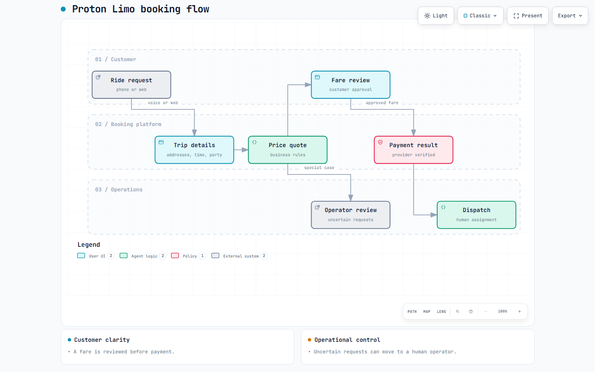

# Proton Limo

**AI-assisted booking and operations for a chauffeured transportation business.**

Proton Limo is an operating transportation business. Its private software project connects customer requests, fare review, payment status, and dispatcher work so a trip can move through clear, inspectable steps.

## The workflow

The engineering work focuses on:

- Capturing trip details from web and voice conversations in a structured form.
- Calculating quotes from business rules and showing the fare for customer review.
- Keeping a quote, an approved booking, and a verified payment as separate states.
- Routing uncertain addresses and special requests to a human operator.
- Recording the outcome for dispatch and customer follow-up.

**Selected stack:** Next.js, TypeScript, Firebase, Stripe, and Retell AI.

## Project activity

| Development history | Pull requests | Commits on main |
| --- | ---: | ---: |
| April–September 2026 (~5 months) | 399 | 1,237 |

*Figures reflect the private development repository as of September 24, 2026. This public repository contains an overview and diagram; the product source remains private.*
